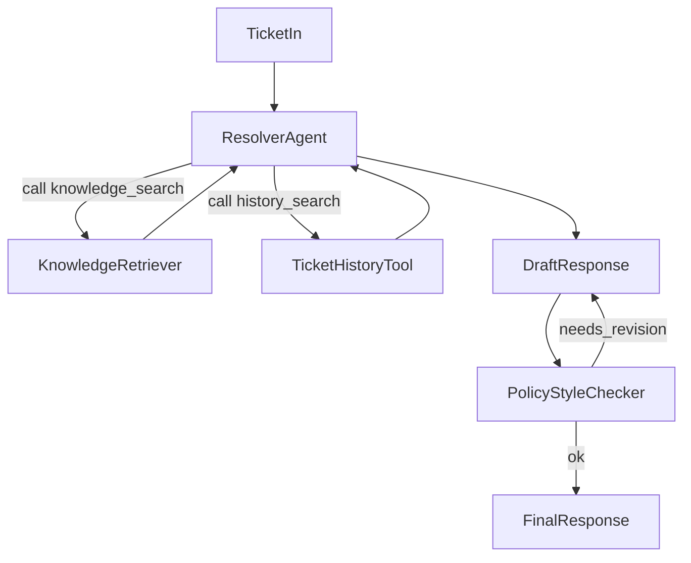

# TicketResolve – Support ticket resolution with an AI agent

**This is the main briefing for the project.** Read it (and the guides) before changing things. The layout is built for TicketResolve and inspired by [ed-donner/alex](https://github.com/ed-donner/alex); we use the Cursor MCP server **"alex Docs"** to pull in that repo’s docs and code when we need reference patterns.

---

## What we’re building

**TicketResolve** is a learning-focused system: an agentic AI that helps resolve support tickets using Amazon Bedrock, S3 Vectors, and a simple web UI. The agent uses a knowledge base (docs + past tickets) and a policy checker to propose and validate customer-facing answers.

In practice:

- **One agent that does the work:** A planner/resolver that searches knowledge and ticket history, drafts a response, and runs it through a policy/style check.
- **RAG on AWS:** S3 Vectors for product docs and historical tickets; Bedrock for chat and embeddings.
- **Simple UI:** Create tickets, hit “resolve”, see the AI’s answer and where it came from.
- **Path to production:** Terraform per component, Lambda (or App Runner), API Gateway, CloudWatch.

We’re aiming to learn how to implement an agentic workflow on AWS, use S3 Vectors and Bedrock in a real pipeline, and keep the repo structured so it can grow toward production (clear boundaries, Terraform, step-by-step guides). Security, monitoring, and deployment come in as we go.

---

## How we work (learning-first)

We build **step-by-step, one module at a time**. Each step has a clear scope; the idea is to understand it, not just run commands.

- **One guide at a time.** Finish Guide 1 before Guide 2, and so on.
- **One module at a time.** Within a guide, finish each section before jumping ahead. We add code and infra in small, testable chunks.
- **Pace it.** Treat each guide (or half of one) as at least a day. Read, run, and poke around instead of racing.
- **Understand the “why”.** For each part we care why we’re doing it (e.g. why S3 Vectors, why this IAM policy), not only that it works.

**Rule for everyone (humans and AI):** Only add or change what the current step needs. Don’t build the resolver or frontend while you’re still on permissions or ingest.

---

## Directory structure

```
ticketresolve/
├── gameplan.md          # This file – briefing for the project
├── README.md            # Quick overview, setup, pointer to guides
│
├── guides/              # Step-by-step (start here)
│   ├── 1_permissions.md
│   ├── 2_vectors_ingest.md
│   ├── 3_agents.md
│   ├── 4_frontend.md
│   └── architecture.md
│
├── backend/             # Python uv workspace
│   ├── api/             # FastAPI – tickets CRUD, POST /tickets/{id}/resolve, GET /tickets/{id}/agent-trace
│   ├── resolver/        # Single agent: orchestration, tools, draft, policy check
│   │   ├── agent.py     # Entrypoint, loop (decide → tools / draft → policy check)
│   │   ├── templates.py # Prompts
│   │   ├── tools.py     # knowledge_search, ticket_history, policy_checker
│   │   ├── test_simple.py
│   │   └── test_full.py
│   ├── ingest/          # Doc/ticket ingestion → S3 Vectors (scripts for now, Lambda later)
│   ├── package_docker.py
│   ├── deploy_all_lambdas.py
│   ├── test_simple.py   # Optional: full API + resolver flow
│   └── test_full.py
│
├── frontend/            # Simple single-page UI
├── terraform/           # One dir per component, separate state
│   ├── 1_permissions/
│   ├── 2_vectors_ingest/
│   ├── 3_agents/
│   └── 4_frontend/
└── scripts/
    ├── deploy.py
    ├── destroy.py
    └── run_local.py
```

We don’t have a separate `backend/planner/` in v1 — orchestration lives inside the resolver. We also don’t have `backend/database/` yet; that comes when we add persistent ticket storage.

---

## Architecture (high level)

- **API:** FastAPI in `backend/api/`. You get `POST/GET /tickets`, `POST /tickets/{id}/resolve`, and `GET /tickets/{id}/agent-trace`.
- **Agent:** One resolver in `backend/resolver/` that runs the full flow: orchestration, tool calls (knowledge search, ticket history, policy checker), draft, and policy/style check. No separate planner package in v1.
- **Data:** One S3 bucket for raw docs, chunks/embeddings (S3 Vectors), and sample tickets. We’ll add a DB package when we persist ticket state.
- **AWS:** Bedrock (chat + optional embeddings), S3 Vectors, Lambda for resolver and/or API, API Gateway, Terraform per component.



---

## Tech choices

- **Python** 3.11+, with **uv** for the backend (uv workspace).
- **Backend:** FastAPI; boto3 for Bedrock and S3; pydantic for models.
- **Orchestration:** LangGraph or a small custom loop (Python state machine + tool calls); we decide in guide 3_agents.
- **Frontend:** Minimal single-page (React or a light Next.js setup).
- **Infra:** Terraform per component; Lambda and/or App Runner for the API; API Gateway.

---

## Guides – order of work

Do these in order. One guide can span one or more days. Finish and understand each before starting the next.

| Guide | What it covers | You’ll leave understanding |
|-------|----------------|----------------------------|
| **1_permissions** | IAM, Bedrock access, S3, AWS CLI | Least-privilege, how we hit Bedrock and S3, and how to set up your local AWS. |
| **2_vectors_ingest** | S3 Vectors bucket, ingest pipeline, embeddings | How RAG data is stored, chunking and embedding, and why we use S3 Vectors here. |
| **3_agents** | Resolver agent, tools, local then Lambda | The agent loop (decide → tools → draft → check), Bedrock tool use, and packaging for Lambda. |
| **4_frontend** | Simple UI + wiring to the API | The full flow: create ticket → resolve → see response and trace. |

Keep **architecture.md** updated as we add components so the big picture stays clear. Don’t start a guide until the previous one is done and you’re comfortable with it.

---

## Data and retrieval

- **Ticket:** id, title, description, category, priority, status, created_at.
- **DocumentChunk:** id, source (doc vs ticket), content, metadata; stored with embeddings in S3 Vectors.
- **S3 layout:** `docs/raw/`, `docs/chunks/` (or S3 Vectors index), `tickets/` for historical tickets.

---

## Production (short version)

- **Security:** IAM least-privilege; optional Cognito/auth for UI/API; S3 and HTTPS.
- **Observability:** CloudWatch logs and metrics; request/trace IDs.
- **Deployment:** Terraform in `terraform/<n>_<name>/`; `scripts/deploy.py` and `scripts/destroy.py` to run it.

---

## Using the Alex MCP in Cursor

When implementing, the **"alex Docs"** MCP server is useful for reference (uv workspace, agent layout, Lambda packaging, Terraform):

- **fetch_alex_documentation** – full Alex overview.
- **search_alex_code** – e.g. `backend/planner`, `backend/api/main.py`, `package_docker.py`.
- **search_alex_documentation** – search over Alex guides.

Our setup is simpler (one resolver, no separate planner or DB package in v1); use Alex only where it helps.

---

## Open decisions

- **Orchestration:** LangGraph vs custom Python (decide in 3_agents).
- **Embeddings:** Bedrock Titan/Cohere vs SageMaker (tradeoff between cost and simplicity).
- **Ticket storage:** In-memory/S3 for v1 vs a database from the start.

---

*Last updated: clarified “How we work” and the learning path.*
