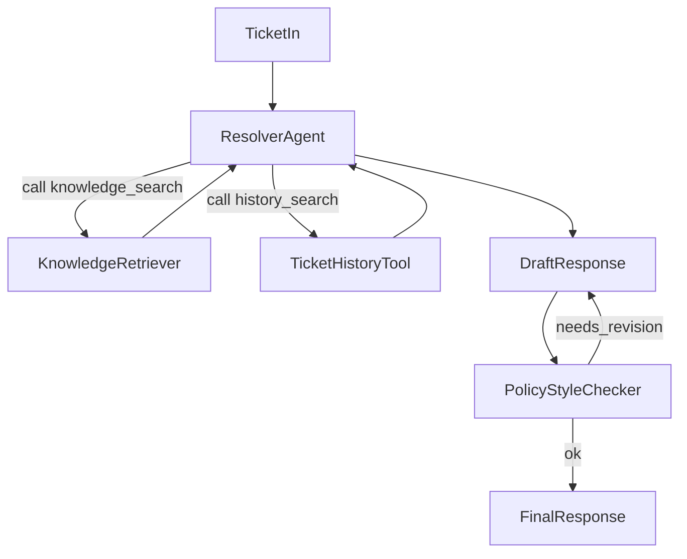

# TicketResolve – Support Ticket Resolution Agentic AI System

**Gameplan for AI and humans.** Read this file (and the linked guides) before making changes. The structure is tailored to TicketResolve and inspired by [ed-donner/alex](https://github.com/ed-donner/alex); use the Cursor MCP server **"alex Docs"** to fetch that repo’s docs and code when implementing.

---

## Project overview

**TicketResolve** is a learning-focused, agentic AI system that helps resolve support tickets using Amazon Bedrock, S3 Vectors, and a simple web UI. Agents use a knowledge base (docs + past tickets) and a policy checker to propose and validate customer-facing responses.

### What we’re building

- **Multi-step agent**: Planner/Resolver that searches knowledge and ticket history, drafts a response, and checks policy/style.
- **RAG**: S3 Vectors for product docs and historical tickets; Bedrock for chat and embeddings.
- **Simple web UI**: Create tickets, trigger “resolve”, view AI response and sources.
- **Production path**: Terraform per component, Lambda (or App Runner), API Gateway, CloudWatch.

### Learning goals

1. Implement an agentic workflow (plan → retrieve → draft → check) on AWS.
2. Use S3 Vectors and Bedrock in a real pipeline.
3. Structure the repo for production (clear boundaries, Terraform, guides).
4. Add security, monitoring, and deployment steps.

---

## How we'll work (learning-focused)

We build **step-by-step, module-by-module, day-by-day**. Each step has a clear scope and learning outcome. Do not skip ahead; finish one module (and understand it) before starting the next.

- **Step-by-step**: One guide at a time. Complete Guide 1 before Guide 2, etc.
- **Module-by-module**: Within a guide, complete each section or sub-task before moving on. Code and infra are added in small, testable pieces.
- **Day-by-day**: Treat each guide (or logical half of a guide) as at least one day of work. Take time to read, run, and experiment rather than rushing.
- **Learning-focused**: For each module, the goal is to understand *why* (e.g. why S3 Vectors, why this IAM policy), not just to get something running. Use the guides to reinforce concepts; ask questions when something is unclear.

**Rule for AI and humans:** When implementing, only add or change what the current step requires. Do not build future modules (e.g. resolver agent) while still on permissions or ingest.

---

## Directory structure

```
ticketresolve/
├── gameplan.md          # This file – briefing for AI and humans
├── README.md            # Overview, setup, pointer to guides
│
├── guides/              # Step-by-step deployment (start here)
│   ├── 1_permissions.md
│   ├── 2_vectors_ingest.md
│   ├── 3_agents.md
│   ├── 4_frontend.md
│   └── architecture.md
│
├── backend/             # Python uv workspace
│   ├── api/             # FastAPI – tickets CRUD + POST /tickets/{id}/resolve
│   ├── resolver/        # Single agent: orchestration + tools + draft + policy check
│   │   ├── agent.py     # Entrypoint, loop (decide → tools / draft → policy check)
│   │   ├── templates.py # Prompts
│   │   ├── tools.py     # knowledge_search, ticket_history, policy_checker
│   │   ├── test_simple.py
│   │   └── test_full.py
│   ├── ingest/          # Doc/ticket ingestion → S3 Vectors (scripts now, Lambda later)
│   ├── package_docker.py
│   ├── deploy_all_lambdas.py
│   ├── test_simple.py   # Optional: full API + resolver flow
│   └── test_full.py
│
├── frontend/            # Simple single-page UI
├── terraform/           # One dir per component, separate state
│   ├── 1_permissions/
│   ├── 2_vectors_ingest/
│   ├── 3_agents/
│   └── 4_frontend/
└── scripts/
    ├── deploy.py
    ├── destroy.py
    └── run_local.py
```

**Not in v1:** `backend/planner/` (orchestration lives inside `resolver`); `backend/database/` (add when we introduce persistent ticket storage).

---

## Architecture (high level)

- **API**: FastAPI in `backend/api/`. Endpoints: `POST/GET /tickets`, `POST /tickets/{id}/resolve`, `GET /tickets/{id}/agent-trace`.
- **Agent**: One **resolver** agent (in `backend/resolver/`) that runs the full flow: orchestration, tool calls (knowledge search, ticket history, policy checker), draft step, and policy/style check. No separate planner package in v1.
- **Data**: S3 bucket for raw docs, chunks/embeddings (S3 Vectors), and sample tickets. Add a DB package when we persist ticket state.
- **AWS**: Bedrock (chat + optional embeddings), S3 Vectors, Lambda for resolver and/or API, API Gateway, Terraform per component.



---

## Technology choices

- **Python**: 3.11+, managed with **uv** (backend as uv workspace).
- **Backend**: FastAPI; boto3 for Bedrock and S3; pydantic for models.
- **Orchestration**: LangGraph or lightweight custom (Python state machine + tool calls); decide in guide 3_agents.
- **Frontend**: Minimal single-page (React or Next.js lite).
- **Infra**: Terraform per component; Lambda (and/or App Runner for API); API Gateway.

---

## Guides – order of work (day-by-day learning path)

Work through these in order. One guide = one or more days. Complete and understand each before starting the next.

| Guide | Focus | Learning outcome |
|-------|--------|-------------------|
| **1_permissions** | IAM, Bedrock access, S3, AWS CLI | Why least-privilege; how Bedrock and S3 are accessed; local AWS setup. |
| **2_vectors_ingest** | S3 Vectors bucket, ingest pipeline, embeddings | How RAG data is stored; chunking and embedding; S3 Vectors vs other vector DBs. |
| **3_agents** | Resolver agent, tools, local then Lambda | Agent loop (decide → tools → draft → check); Bedrock tool use; packaging for Lambda. |
| **4_frontend** | Simple UI + API wiring | End-to-end flow: create ticket → resolve → view response and trace. |

- **architecture.md**: Update as we add each component so the big picture stays clear.
- Do not start a guide until the previous one is done and you’re comfortable with it.

---

## Data and retrieval

- **Ticket**: id, title, description, category, priority, status, created_at.
- **DocumentChunk**: id, source (doc vs ticket), content, metadata; stored with embeddings in S3 Vectors.
- **S3 layout**: `docs/raw/`, `docs/chunks/` (or S3 Vectors index), `tickets/` for historical tickets.

---

## Productionization (summary)

- **Security**: IAM least-privilege; optional Cognito/auth for UI/API; S3 and HTTPS.
- **Observability**: CloudWatch logs and metrics; request/trace IDs.
- **Deployment**: Terraform in `terraform/<n>_<name>/`; `scripts/deploy.py` and `scripts/destroy.py` to orchestrate.

---

## Using the Alex MCP in Cursor

When implementing, use the **"alex Docs"** MCP server for reference patterns (uv workspace, agent layout, Lambda packaging, Terraform):

- **fetch_alex_documentation** – full Alex overview.
- **search_alex_code** – e.g. `backend/planner`, `backend/api/main.py`, `package_docker.py`.
- **search_alex_documentation** – semantic search over Alex guides.

Our structure is simpler (one resolver agent, no separate planner or database package in v1); use Alex only where helpful.

---

## Open decisions

- **Orchestration**: LangGraph vs custom Python (to be decided in 3_agents).
- **Embeddings**: Bedrock Titan/Cohere vs SageMaker (cost vs simplicity).
- **Ticket storage**: In-memory/S3 for v1 vs database from the start.

---

*Last updated: added "How we'll work" (step-by-step, module-by-module, day-by-day, learning-focused) and learning path table.*
